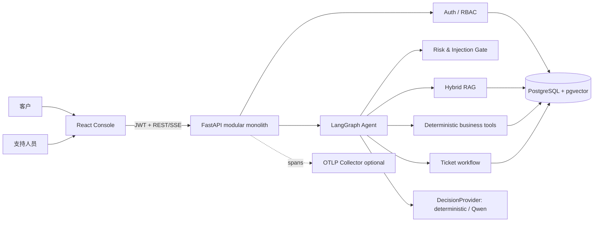
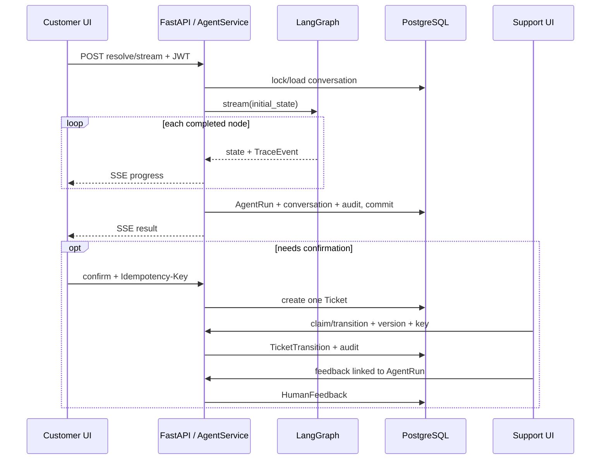

# SupportPilot 系统架构

## 组件视图

## 核心数据闭环

## 关键不变量

- LLM 只给出结构化意图，不计算额度、不判断权限、不直接执行高风险动作；
- 知识回答必须通过 Answerability Gate 并带 chunk 级引用；
- 写操作同时使用事务、幂等键、唯一约束和版本检查；
- 高风险请求直接拒绝并审计，Prompt Injection 在模型/工具之前预检；
- 最终 SSE result 在数据库 commit 后发送。
